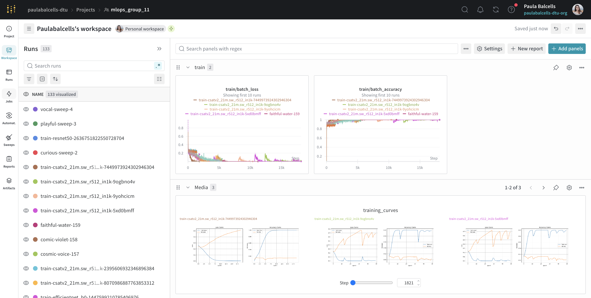
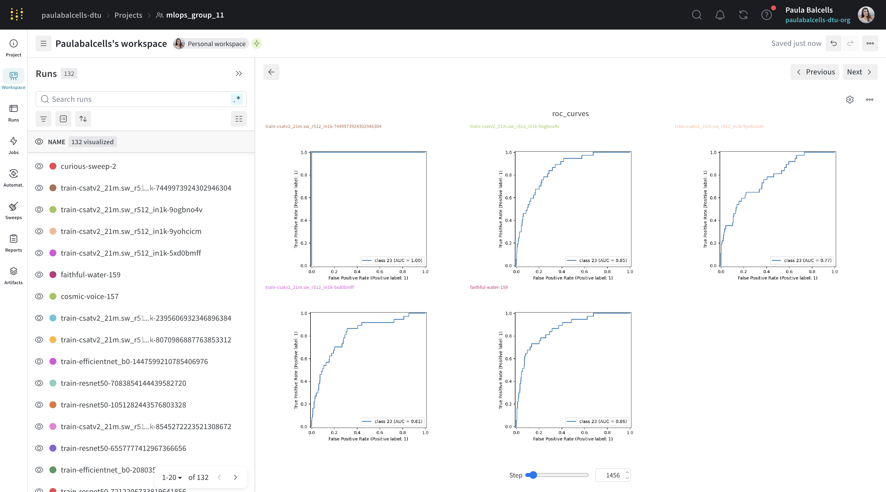
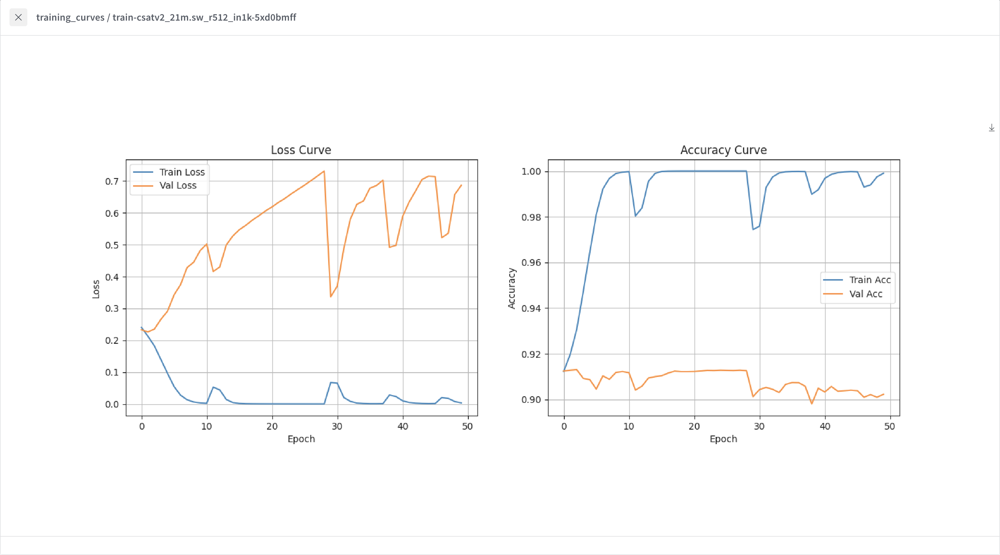
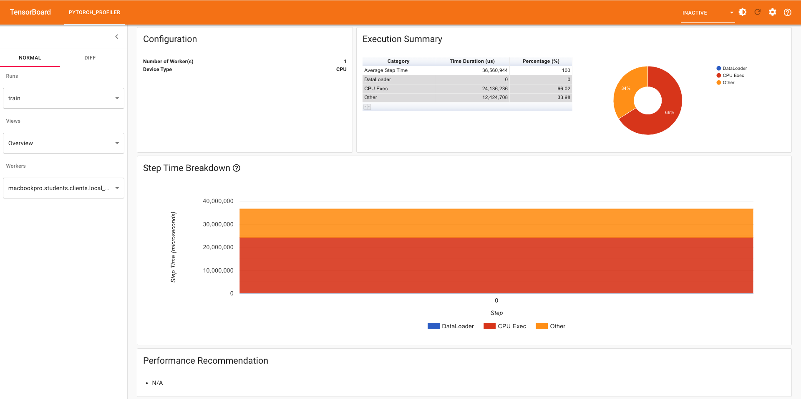
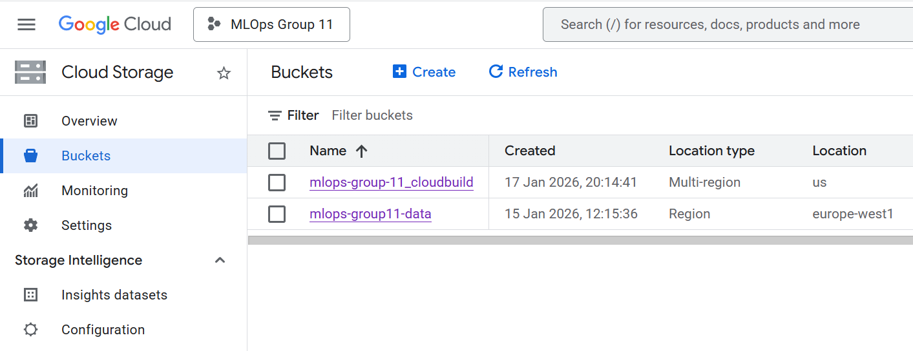
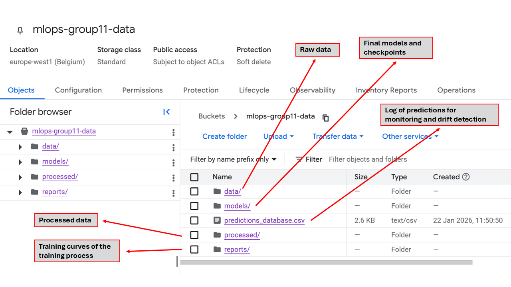
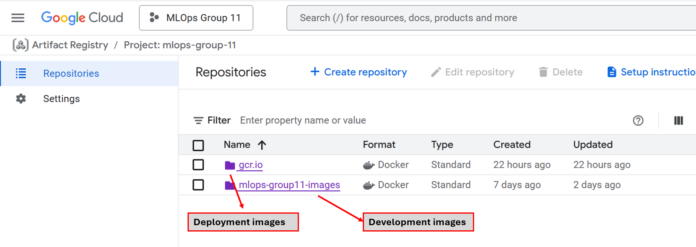
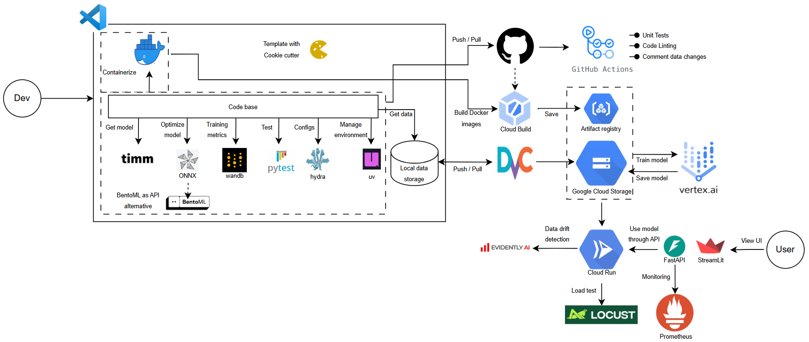

# Exam template for 02476 Machine Learning Operations

This is the report template for the exam. Please only remove the text formatted as with three dashes in front and behind
like:

```--- question 1 fill here ---```

Where you instead should add your answers. Any other changes may have unwanted consequences when your report is
auto-generated at the end of the course. For questions where you are asked to include images, start by adding the image
to the `figures` subfolder (please only use `.png`, `.jpg` or `.jpeg`) and then add the following code in your answer:

``

In addition to this markdown file, we also provide the `report.py` script that provides two utility functions:

Running:

```bash
python report.py html
```

Will generate a `.html` page of your report. After the deadline for answering this template, we will auto-scrape
everything in this `reports` folder and then use this utility to generate a `.html` page that will be your serve
as your final hand-in.

Running

```bash
python report.py check
```

Will check your answers in this template against the constraints listed for each question e.g. is your answer too
short, too long, or have you included an image when asked. For both functions to work you mustn't rename anything.
The script has two dependencies that can be installed with

```bash
pip install typer markdown
```

or

```bash
uv add typer markdown
```

## Overall project checklist

The checklist is *exhaustive* which means that it includes everything that you could do on the project included in the
curriculum in this course. Therefore, we do not expect at all that you have checked all boxes at the end of the project.
The parenthesis at the end indicates what module the bullet point is related to. Please be honest in your answers, we
will check the repositories and the code to verify your answers.

### Week 1

* [x] Create a git repository (M5)
* [x] Make sure that all team members have write access to the GitHub repository (M5)
* [x] Create a dedicated environment for you project to keep track of your packages (M2)
* [x] Create the initial file structure using cookiecutter with an appropriate template (M6)
* [x] Fill out the `data.py` file such that it downloads whatever data you need and preprocesses it (if necessary) (M6)
* [x] Add a model to `model.py` and a training procedure to `train.py` and get that running (M6)
* [x] Remember to either fill out the `requirements.txt`/`requirements_dev.txt` files or keeping your
    `pyproject.toml`/`uv.lock` up-to-date with whatever dependencies that you are using (M2+M6)
* [x] Remember to comply with good coding practices (`pep8`) while doing the project (M7)
* [x] Do a bit of code typing and remember to document essential parts of your code (M7)
* [x] Setup version control for your data or part of your data (M8)
* [x] Add command line interfaces and project commands to your code where it makes sense (M9)
* [x] Construct one or multiple docker files for your code (M10)
* [x] Build the docker files locally and make sure they work as intended (M10)
* [x] Write one or multiple configurations files for your experiments (M11)
* [x] Used Hydra to load the configurations and manage your hyperparameters (M11)
* [x] Use profiling to optimize your code (M12)
* [x] Use logging to log important events in your code (M14)
* [x] Use Weights & Biases to log training progress and other important metrics/artifacts in your code (M14)
* [x] Consider running a hyperparameter optimization sweep (M14)
* [ ] Use PyTorch-lightning (if applicable) to reduce the amount of boilerplate in your code (M15)

### Week 2

* [x] Write unit tests related to the data part of your code (M16)
* [x] Write unit tests related to model construction and or model training (M16)
* [x] Calculate the code coverage (M16)
* [x] Get some continuous integration running on the GitHub repository (M17)
* [x] Add caching and multi-os/python/pytorch testing to your continuous integration (M17)
* [x] Add a linting step to your continuous integration (M17)
* [x] Add pre-commit hooks to your version control setup (M18)
* [x] Add a continues workflow that triggers when data changes (M19)
* [ ] Add a continues workflow that triggers when changes to the model registry is made (M19)
* [x] Create a data storage in GCP Bucket for your data and link this with your data version control setup (M21)
* [x] Create a trigger workflow for automatically building your docker images (M21)
* [x] Get your model training in GCP using either the Engine or Vertex AI (M21)
* [x] Create a FastAPI application that can do inference using your model (M22)
* [x] Deploy your model in GCP using either Functions or Run as the backend (M23)
* [x] Write API tests for your application and setup continues integration for these (M24)
* [x] Load test your application (M24)
* [x] Create a more specialized ML-deployment API using either ONNX or BentoML, or both (M25)
* [x] Create a frontend for your API (M26)

### Week 3

* [x] Check how robust your model is towards data drifting (M27)
* [x] Setup collection of input-output data from your deployed application (M27)
* [x] Deploy to the cloud a drift detection API (M27)
* [x] Instrument your API with a couple of system metrics (M28)
* [ ] Setup cloud monitoring of your instrumented application (M28)
* [ ] Create one or more alert systems in GCP to alert you if your app is not behaving correctly (M28)
* [x] If applicable, optimize the performance of your data loading using distributed data loading (M29)
* [ ] If applicable, optimize the performance of your training pipeline by using distributed training (M30)
* [ ] Play around with quantization, compilation and pruning for you trained models to increase inference speed (M31)

### Extra

* [ ] Write some documentation for your application (M32)
* [ ] Publish the documentation to GitHub Pages (M32)
* [x] Revisit your initial project description. Did the project turn out as you wanted?
* [x] Create an architectural diagram over your MLOps pipeline
* [x] Make sure all group members have an understanding about all parts of the project
* [x] Uploaded all your code to GitHub

## Group information

### Question 1
> **Enter the group number you signed up on <learn.inside.dtu.dk>**
>
> Answer:

11

### Question 2
> **Enter the study number for each member in the group**
>
> Example:
>
> *sXXXXXX, sXXXXXX, sXXXXXX*
>
> Answer:

s253528, s253509, s231439, s242800, s215811

### Question 3
> **Did you end up using any open-source frameworks/packages not covered in the course during your project? If so**
> **which did you use and how did they help you complete the project?**
>
> Recommended answer length: 0-200 words.
>
> Example:
> *We used the third-party framework ... in our project. We used functionality ... and functionality ... from the*
> *package to do ... and ... in our project*.
>
> Answer:

We used the *PyTorch Image Models (timm)* library to load a pretrained computer vision model, which sped up training and improved performance by taking advantage of state-of-the-art architectures and pretrained weights. We also used *torchvision* for image transformations during training.

## Coding environment

> In the following section we are interested in learning more about you local development environment. This includes
> how you managed dependencies, the structure of your code and how you managed code quality.

### Question 4

> **Explain how you managed dependencies in your project? Explain the process a new team member would have to go**
> **through to get an exact copy of your environment.**
>
> Recommended answer length: 100-200 words
>
> Example:
> *We used ... for managing our dependencies. The list of dependencies was auto-generated using ... . To get a*
> *complete copy of our development environment, one would have to run the following commands*
>
> Answer:

We used uv together with pyproject.toml and a corresponding lock file to manage our project dependencies. All runtime and development dependencies are explicitly declared with fixed versions to ensure full reproducibility across machines and avoid version drift.
In addition, the project is containerized using Docker. When building the Docker image, the container installs all dependencies from the lock file along with system-level packages and the specified Python version. The resulting Docker images are stored in Artifact Registry and were used to train our model on Vertex AI, ensuring that the cloud training environment matches the development environment.
Anyone can reproduce the exact environment by cloning the repository and either installing dependencies locally via uv or building and running the Docker image. To recreate the development environment locally, the following commands can be run (after installing uv following the official guide [here](https://docs.astral.sh/uv/getting-started/installation/)):

```bash
uv venv --python 3.13
source .venv/bin/activate
uv sync
```

### Question 5

> **We expect that you initialized your project using the cookiecutter template. Explain the overall structure of your**
> **code. What did you fill out? Did you deviate from the template in some way?**
>
> Recommended answer length: 100-200 words
>
> Example:
> *From the cookiecutter template we have filled out the ... , ... and ... folder. We have removed the ... folder*
> *because we did not use any ... in our project. We have added an ... folder that contains ... for running our*
> *experiments.*
>
> Answer:

Our project was based on the cookiecutter template without the AI agents option, and we have slightly adapted it.

A deviation from the template we have performed is adding a scripts folder with various scripts we have used to generate the ONNX model, create the hyperparameter sweep and download data from GCS. We have also added an api folder which includes the files for both the FastAPI and the BentoML API. We also removed requirements.txt and requirements-dev.txt and instead we managed the dependencies for the uv environment in pyproject.toml.

The tree structure of the project can be found [here](../README.md#project-structure).

### Question 6

> **Did you implement any rules for code quality and format? What about typing and documentation? Additionally,**
> **explain with your own words why these concepts matters in larger projects.**
>
> Recommended answer length: 100-200 words.
>
> Example:
> *We used ... for linting and ... for formatting. We also used ... for typing and ... for documentation. These*
> *concepts are important in larger projects because ... . For example, typing ...*
>
> Answer:

We used ruff for linting and formatting. We have also used mypy to check typing. We have tried to add documentation and comments every time we would add a new function. Docstrings were also implemented in the major functions as well as inline comments to explain logic. In the case of larger procedures (such as data setup and W&B Hyperparameter Sweep), md files were also created in order to explain to other team members (or repository visitors) how they are used. These concepts are essential in larger projects and when working in collaboration with others, as code must be readable, understandable and maintainable. Poor readability increases the time required for others to understand and work with the code.

## Version control

> In the following section we are interested in how version control was used in your project during development to
> corporate and increase the quality of your code.

### Question 7

> **How many tests did you implement and what are they testing in your code?**
>
> Recommended answer length: 50-100 words.
>
> Example:
> *In total we have implemented X tests. Primarily we are testing ... and ... as these the most critical parts of our*
> *application but also ... .*
>
> Answer:

In total, we implemented three-unit test modules, covering the data pipeline, model construction, and training logic. It added up to a total of 11 unit tests for these modules. The data tests verify dataset loading, preprocessing, correct tensor shapes, and proper error handling when processed files or split ratios are invalid. The model tests ensure defensive input validation and confirm that the neural network produces outputs with the correct shape and datatype. Finally, the training test checks that the training loop exits cleanly when required data is missing, preventing crashes during execution.

### Question 8

> **What is the total code coverage (in percentage) of your code? If your code had a code coverage of 100% (or close**
> **to), would you still trust it to be error free? Explain you reasoning.**
>
> Recommended answer length: 100-200 words.
>
> Example:
> *The total code coverage of code is X%, which includes all our source code. We are far from 100% coverage of our **
> *code and even if we were then...*
>
> Answer:

The total code coverage of code is 42%, including tests for the data, training and evaluation procedures, the model, and the API. We are far from 100% coverage of our code, particularly in the main training and inference loops which would require complex mocking of full training workflows (e.g. W&B logging, GCS storage). Even if our code coverage were close to or at 100%, we would not consider the software to be completely error free. Code coverage only measures which lines of code are executed during testing, not whether the tests effectively validate correct behavior. For example, edge cases may not be fully explored, integration between components may fail even if individual components are well-tested, and tests can have bugs themselves.

### Question 9

> **Did you workflow include using branches and pull requests? If yes, explain how. If not, explain how branches and**
> **pull request can help improve version control.**
>
> Recommended answer length: 100-200 words.
>
> Example:
> *We made use of both branches and PRs in our project. In our group, each member had an branch that they worked on in*
> *addition to the main branch. To merge code we ...*
>
> Answer:

We have used branches and PRs in our project. We have created a new branch for every big feature, named based on our initials followed by the feature name (e.g.: `pb/replace-data-download-script-with-dvc`). These branches usually corresponded to various points out of the project’s checklist; points that were discussed within the team beforehand. Once we committed and pushed the changes on the branches, we would create PRs and, if all checks passed, we would communicate with the group the intention to merge to main. As a general rule, we never merged without the approval of at least another member of the team. There were times where checks did not pass and other team members made the corrections. In the case of PRs closely related (or consequent) to the ones of another team member, we created a specific request of that person to review it.

### Question 10

> **Did you use DVC for managing data in your project? If yes, then how did it improve your project to have version**
> **control of your data. If no, explain a case where it would be beneficial to have version control of your data.**
>
> Recommended answer length: 100-200 words.
>
> Example:
> *We did make use of DVC in the following way: ... . In the end it helped us in ... for controlling ... part of our*
> *pipeline*
>
> Answer:

DVC was used to manage the movie poster dataset (as can be seen in data.dvc and .dvc folder). To avoid storing heavy files in our repository, data is stored in a Google Cloud Bucket, allowing team members to version and share large datasets efficiently.

Originally, in our training pipeline, we integrated DVC pulls directly into the Docker container workflow to automate and ensure the correct data version was always used in Vertex AI. However, this dvc pull process presented problems and froze during downloads. Therefore, we pulled the data from the Cloud Bucket using gsutil, which proved a good alternative.

Even though we only had a single version of data, we implemented DVC as a good practice for future improvements as it helps us with reproducibility, facilitates experimentation, and (perhaps in a future) ensures auditability when combined with the git commits.


### Question 11

> **Discuss you continuous integration setup. What kind of continuous integration are you running (unittesting,**
> **linting, etc.)? Do you test multiple operating systems, Python  version etc. Do you make use of caching? Feel free**
> **to insert a link to one of your GitHub actions workflow.**
>
> Recommended answer length: 200-300 words.
>
> Example:
> *We have organized our continuous integration into 3 separate files: one for doing ..., one for running ... testing*
> *and one for running ... . In particular for our ..., we used ... .An example of a triggered workflow can be seen*
> *here: <weblink>*
>
> Answer:

We have organized our continuous integration into 5 separate workflow files:

1. Unit Testing (`tests.yaml`): This workflow runs our test suite using pytest with coverage reporting. It tests across multiple operating systems (Ubuntu, Windows, macOS) and Python versions (3.11, 3.12) to ensure cross-platform compatibility. We use a matrix strategy with fail-fast: false to see all failures across environments. The workflow integrates with Codecov to track test coverage over time. We leverage setup-python's built-in caching (enable-cache: true) to speed up dependency installation.

2. Code Linting (`linting.yaml`): This runs Ruff for both code quality checks (`ruff check`) and formatting verification (`ruff format --check`). We run this only on Ubuntu with Python 3.12 since linting results are consistent across platforms. This also uses Python caching to improve performance.

3. Pre-commit Auto-update (`pre-commit-update.yaml`): This scheduled workflow runs daily to automatically update pre-commit hooks and creates pull requests with the updates, helping keep our development tools current.

4. Docker Building (`docker-building.yaml`): Currently commented out as we've migrated to Google Cloud Build triggers for container image CI/CD.

5. DVC Data (`cml-data.yaml`): This workflow is triggered by pull requests that include changes to the dataset. It automatically analyzes the updated data and posts comments on the pull request with statistics about the current data structure, providing transparency into the changes.

All workflows use UV for fast, reliable dependency management with locked dependencies (`uv sync --locked`), ensuring reproducible builds. An example workflow run can be seen in the Actions tab of our repository.


## Running code and tracking experiments

> In the following section we are interested in learning more about the experimental setup for running your code and
> especially the reproducibility of your experiments.

### Question 12

> **How did you configure experiments? Did you make use of config files? Explain with coding examples of how you would**
> **run a experiment.**
>
> Recommended answer length: 50-100 words.
>
> Example:
> *We used a simple argparser, that worked in the following way: Python  my_script.py --lr 1e-3 --batch_size 25*
>
> Answer:

We configured experiments using Hydra with yaml config files and Weights & Biases for hyperparameter sweeps. The configuration parameters (model, hyperparameters, paths) are stored in a config.yaml file in the configs/ folder, but can be overwritten with custom parameters when running a single experiment as follows:

`python src/mlops_group_11/train.py hyperparameters.lr=0.001 hyperparameters.batch_size=32 hyperparameters.epochs=10`

For hyperparameter sweeps, we used sweep.yaml config file and run it through W&B sweep:

`uv run wandb sweep configs/sweep.yaml`

`uv run wandb agent <wandb_team>/<wandb_project>/<sweep_id>`


### Question 13

> **Reproducibility of experiments are important. Related to the last question, how did you secure that no information**
> **is lost when running experiments and that your experiments are reproducible?**
>
> Recommended answer length: 100-200 words.
>
> Example:
> *We made use of config files. Whenever an experiment is run the following happens: ... . To reproduce an experiment*
> *one would have to do ...*
>
> Answer:

We ensured reproducibility in various ways:

1. Using config files to store the model architecture used, all hyperparameters, random seeds, normalization parameters, and data split ratios.

2. Logging every experiment run to Weights & Biases with unique job IDs, tracking hyperparameters, metrics, visualizations, and model artifacts with metadata.

3. Saving models together with metadata including number of epochs, batch size, and metrics obtained. There were also periodic checkpoints that saved every amount of epochs. Final models and checkpoints were automatically stored in our Google Cloud Bucket.

4. Ensuring data consistency through DVC to version-control preprocessed data.

To reproduce an experiment, one would have to use the saved Hydra config, pull the data version, and retrieve the exact model weights from W&B artifacts. As final models were also stored in Google Cloud with unique job IDs matching those in W&B, one could also retrieve the model from the cloud using the ID.

### Question 14

> **Upload 1 to 3 screenshots that show the experiments that you have done in W&B (or another experiment tracking**
> **service of your choice). This may include loss graphs, logged images, hyperparameter sweeps etc. You can take**
> **inspiration from [this figure](figures/wandb.png). Explain what metrics you are tracking and why they are**
> **important.**
>
> Recommended answer length: 200-300 words + 1 to 3 screenshots.
>
> Example:
> *As seen in the first image when have tracked ... and ... which both inform us about ... in our experiments.*
> *As seen in the second image we are also tracking ... and ...*
>
> Answer:

For the experiments in W&B, we tracked loss and accuracy for both training and validation datasets in the training loop. We also logged batch-level metrics, training batch images, and gradient histograms every 10 batches to monitor data quality and training dynamics. At the end of training, we logged ROC curves for multi-label classification and saved the final trained model as a W&B artifact together with metrics (accuracy, precision, recall, and F1). These metrics helped us understand model performance across different configurations and identify potential training issues. For hyperparameter sweeps, W&B aggregated results across runs, allowing us to identify the best hyperparameter configuration.


However, validation loss and accuracy curves were only logged as images (media), instead of using the default wandb.log() which provides interactive curves like the training logs. This could have been an area of improvement, as logging validation metrics the same way as training metrics would have allowed for better visual inspection directly in the W&B dashboard. The validation results were still available in the media tab and as part of the final saved artifact, but interactive comparison would have been more convenient.





### Question 15

> **Docker is an important tool for creating containerized applications. Explain how you used docker in your**
> **experiments/project? Include how you would run your docker images and include a link to one of your docker files.**
>
> Recommended answer length: 100-200 words.
>
> Example:
> *For our project we developed several images: one for training, inference and deployment. For example to run the*
> *training docker image: `docker run trainer:latest lr=1e-3 batch_size=64`. Link to docker file: <weblink>*
>
> Answer:

We used docker to containerize different processes of our pipeline, ensuring the reproducibility and portability across different environments. We developed images for both the development and deployment phases. In the case of the development they were made for the local train, Vertex AI train, and evaluation. On the other hand, for the deployment, they were made for the api deployment, frontend, and drift monitoring.

One example of docker image was the [train_vertex.dockerfile](../dockerfiles/train_vertex.dockerfile) which supports both regular training runs and W&B hyperparameter sweeps. Both can be run with:

```bash
# Run regular training
docker run --name vertex-train train-vertex:latest

# Run as W&B sweep agent
docker run -e WANDB_SWEEP_ID=<sweep_id> train-vertex:latest
```

Where WANDB_SWEEP_ID is the sweep ID generated by W&B.


### Question 16

> **When running into bugs while trying to run your experiments, how did you perform debugging? Additionally, did you**
> **try to profile your code or do you think it is already perfect?**
>
> Recommended answer length: 100-200 words.
>
> Example:
> *Debugging method was dependent on group member. Some just used ... and others used ... . We did a single profiling*
> *run of our main code at some point that showed ...*
>
> Answer:

Debugging method was dependent on each group member, and in general we all had configured the built-in python debugger in VScode for breakpoints and step through. We also used logs from `wandb`, local training or API to guide us on where to find the bugs. We tried profiling our training code using both `cProfile` (together with `snakeviz`) and PyTorch profiling integrated with TensorBoard via the trace handler. For the PyTorch profiling, we configured the profiling to run only for a reduced number of batches and epochs specified in the profiling section in `config.yaml` file, to keep the profiling overhead manageable. The profiling results were stored in a non-git tracked outputs folder.

In this image, we show initial PyTorch profiling results in TensorBoard for one epoch and ten batches:



Profiling was mostly useful to discard dataloader issues or bottlenecks, but we did not get any performance recommendations that we could apply. Although the code is not “perfect”, we considered the current performance to be acceptable for our scope.

## Working in the cloud

> In the following section we would like to know more about your experience when developing in the cloud.

### Question 17

> **List all the GCP services that you made use of in your project and shortly explain what each service does?**
>
> Recommended answer length: 50-200 words.
>
> Example:
> *We used the following two services: Engine and Bucket. Engine is used for... and Bucket is used for...*
>
> Answer:

GCP was largely used in the project including the services of:

* Cloud Storage (Bucket): it allows the use of cloud storage so large data is not stored locally or in the repository. We used Buckets for the original and processed data, as well as for storing the final trained models and checkpoints.

* Vertex AI: development platforms used to train and deploy models. We used it to train our models using Google’s computational resources.

* Cloud Run: serverless platform that runs containerized applications. We used it to deploy our prediction API, frontend interface, and drift monitoring system. Its dashboard also allowed us to track metrics of each deployment.

* Cloud Build: serverless CI/CD platform that we used as an alternative to building Docker images locally, having an automatic push to the Artifact Registry service.

* Artifact Registry: a service for storing and managing container images and other artifacts. We used it to store the Docker images built by Cloud Build. This gave us an alternative so Vertex AI and Cloud Run could pull the images for deployment or training.

Note: sometimes the Cloud Build would fail, so the Docker images were built locally.


### Question 18

> **The backbone of GCP is the Compute engine. Explained how you made use of this service and what type of VMs**
> **you used?**
>
> Recommended answer length: 100-200 words.
>
> Example:
> *We used the compute engine to run our ... . We used instances with the following hardware: ... and we started the*
> *using a custom container: ...*
>
> Answer:

We did not use the service of Google Compute Engine directly, but we did configure compute resources through Vertex AI Custom Jobs (model training). For the training (specially with the more demanding W&B hyperparameter sweeps), we specified some virtual machine configurations in Vertex AI config files (secret), looking like:
```yaml
workerPoolSpecs:
  - machineSpec:
      machineType: e2-standard-8  # 8 vCPUs, 32 GB RAM
    replicaCount: 1
```

For the first time, we trained data this way, without distributing the work (single-node). Later we optimized the process through distributed data loading by configuring multiple worker pools:
```yaml
workerPoolSpecs:
- machineSpec:
machineType: e2-standard-8 # Chief node
  replicaCount: 1 # Master worker (required)
- machineSpec:
machineType: e2-standard-8 # Worker nodes
  replicaCount: 3 # 3 additional workers
```

This configuration created a distributed setup with 4 nodes, achieving faster training. Finally, we also tried distributed training, but our request for more GPUs was denied by Google.


### Question 19

> **Insert 1-2 images of your GCP bucket, such that we can see what data you have stored in it.**
> **You can take inspiration from [this figure](figures/bucket.png).**
>
> Answer:




### Question 20

> **Upload 1-2 images of your GCP artifact registry, such that we can see the different docker images that you have**
> **stored. You can take inspiration from [this figure](figures/registry.png).**
>
> Answer:



### Question 21

> **Upload 1-2 images of your GCP cloud build history, so we can see the history of the images that have been build in**
> **your project. You can take inspiration from [this figure](figures/build.png).**
>
> Answer:


### Question 22

> **Did you manage to train your model in the cloud using either the Engine or Vertex AI? If yes, explain how you did**
> **it. If not, describe why.**
>
> Recommended answer length: 100-200 words.
>
> Example:
> *We managed to train our model in the cloud using the Engine. We did this by ... . The reason we choose the Engine*
> *was because ...*
>
> Answer:

Yes. We initially trained the model locally (a single model, 10 epochs), but the amount of time it took was excessive. Therefore, we used Vertex AI for training the model in the cloud, specially for the case of hyperparameter sweep. We did this by a combination of Google Cloud Services. First we created a Google Bucket with the data, as well as used Google Build to build and push the images to the Artifact Registry from which the Vertex AI took them and started the training. We chose Vertex AI as it presents an automatic configuration and allocation of computational resources, however, we specified the machine type for it to use a good enough (and cheap) processing power. Sadly we could not use GPU as Google did not provide us with it, so it took a considerable amount of time to complete, but also allowed us to automatically save checkpoints and final models to our Google Bucket.

## Deployment

### Question 23

> **Did you manage to write an API for your model? If yes, explain how you did it and if you did anything special. If**
> **not, explain how you would do it.**
>
> Recommended answer length: 100-200 words.
>
> Example:
> *We did manage to write an API for our model. We used FastAPI to do this. We did this by ... . We also added ...*
> *to the API to make it more ...*
>
> Answer:

We implemented an API for our trained model using FastAPI. The API provides a /health and /predict endpoints. The API uses the same image preprocessing steps during prediction as were used during training, such as resizing the image and applying normalization. This ensures that the model receives input in a format it understands and can produce reliable results. The model and label files are loaded only when they are first needed and then kept locally, which improves startup time and makes the service more efficient in a cloud environment. The API also includes basic input validation, such as checking file size and verifying that the uploaded file is a valid image, to prevent errors and ensure stable operation.

We also implemented a BentoML-based alternative API for our movie poster genre classification model. 
The API works with the ONNX converted model for faster inference. The @bentoml.service decorator configures the service with 4 concurrent workers, enabling parallel request processing. Configuration management is centralized through Hydra, loading hyperparameters (model architecture, normalization statistics, classification thresholds) from our config file.


### Question 24

> **Did you manage to deploy your API, either in locally or cloud? If not, describe why. If yes, describe how and**
> **preferably how you invoke your deployed service?**
>
> Recommended answer length: 100-200 words.
>
> Example:
> *For deployment we wrapped our model into application using ... . We first tried locally serving the model, which*
> *worked. Afterwards we deployed it in the cloud, using ... . To invoke the service an user would call*
> *`curl -X POST -F "file=@file.json"<weburl>`*
>
> Answer:

We successfully deployed our API both locally and in the cloud.

**Local Deployment:**

We tested our API locally in two ways. First, using Docker directly:

```
docker build -f dockerfiles/api.dockerfile -t poster-classifier:latest .
docker run -p 8000:8000 poster-classifier:latest serve --production
```

We also used docker-compose for a complete local deployment setup with the API and frontend integrated:

```
docker-compose up
```

The API can then be invoked locally by sending image data to the endpoint:

```
curl -X POST -F "file=@image.jpg" http://localhost:8000/predict
```

**Cloud Deployment:**

After verifying local functionality, we deployed the API image to Google Cloud Run using the `gcloud` CLI. The deployment can be invoked using the Cloud Run service URL:

```
curl -X POST -F "file=@image.jpg" https://movie-poster-api-426073227638.europe-west1.run.app/predict
```

We also deployed a Streamlit frontend and a drift monitoring service to Cloud Run. The frontend provides a user-friendly interface for making predictions, while the drift monitoring system continuously tracks data drift and logs metrics to Cloud Run dashboard.

### Question 25

> **Did you perform any unit testing and load testing of your API? If yes, explain how you did it and what results for**
> **the load testing did you get. If not, explain how you would do it.**
>
> Recommended answer length: 100-200 words.
>
> Example:
> *For unit testing we used ... and for load testing we used ... . The results of the load testing showed that ...*
> *before the service crashed.*
>
> Answer:

Yes, we performed both unit testing and load testing of our API. For unit testing we used pytest together with FastAPI’s TestClient. We wrote tests for /health and /predict, and we mocked the model/device/labels so the tests run fast and do not depend on downloading real model files test_api. The /predict test uploads a small in-memory image and checks that the response contains the expected fields (predicted, topk) and returns the correct number of top-k predictions.

For load testing, we used Locust to simulate concurrent users sending requests to the API. The test included both the /health and /predict endpoints, with health checks occurring more frequently to reflect realistic usage patterns. We tested the service with 200 concurrent users, a spawn rate of 5 users per second, and a runtime of 2 minutes. At this load level, the service began to show its first failures, with approximately 1.15% failed health requests and 4.24% failed prediction requests after around 860 aggregated requests. Prediction latency increased significantly under load, reaching over 60 seconds for some requests. This shows that while the API remains stable under moderate load, model inference becomes the main performance bottleneck at higher concurrency levels. Additional tests with higher user counts and spawn rates confirmed this behavior, with failures consistently appearing once the request volume exceeded approximately 700 requests.

### Question 26

> **Did you manage to implement monitoring of your deployed model? If yes, explain how it works. If not, explain how**
> **monitoring would help the longevity of your application.**
>
> Recommended answer length: 100-200 words.
>
> Example:
> *We did not manage to implement monitoring. We would like to have monitoring implemented such that over time we could*
> *measure ... and ... that would inform us about this ... behaviour of our application.*
>
> Answer:

The Fast API includes monitoring using Prometheus to track errors and performance metrics.

The following metrics are tracked with Prometheus: 
1. Error Counters
prediction_error: Tracks the total number of errors that occur during prediction requests. Increments when exceptions are raised in the /predict endpoint Useful for monitoring prediction service reliability.
health_error: Tracks the total number of errors on the health check endpoint. Increments when the /health endpoint fails. Useful for monitoring overall service availability.

2. Performance Metrics
prediction_latency_seconds: Histogram tracking the latency of prediction requests. Measures the complete duration of each /predict request. Helps identify performance degradation and bottlenecks.
In order to view the metrics, the Fast API has to be started.

```bash
# From within the src directory
cd src
uvicorn mlops_group_11.api.fast_api:app --reload
```

Once the API is running, the monitoring results can be found by navigating to the /metrics endpoint (http://localhost:8000/metrics/).

Example metrics output:
```bash
# HELP prediction_error Number of prediction errors
# TYPE prediction_error counter
prediction_error 0.0

# HELP health_error Number of health errors
# TYPE health_error counter
health_error 0.0

# HELP prediction_latency_seconds Prediction latency in seconds
# TYPE prediction_latency_seconds histogram
prediction_latency_seconds_bucket{le="0.005"} 0.0
prediction_latency_seconds_bucket{le="0.01"} 0.0
prediction_latency_seconds_bucket{le="0.025"} 2.0
prediction_latency_seconds_bucket{le="0.05"} 5.0
prediction_latency_seconds_bucket{le="0.075"} 8.0
prediction_latency_seconds_bucket{le="0.1"} 10.0
prediction_latency_seconds_bucket{le="0.25"} 15.0
prediction_latency_seconds_bucket{le="0.5"} 20.0
prediction_latency_seconds_bucket{le="0.75"} 20.0
prediction_latency_seconds_bucket{le="1.0"} 20.0
prediction_latency_seconds_bucket{le="2.5"} 20.0
prediction_latency_seconds_bucket{le="5.0"} 20.0
prediction_latency_seconds_bucket{le="7.5"} 20.0
prediction_latency_seconds_bucket{le="10.0"} 20.0
prediction_latency_seconds_bucket{le="+Inf"} 20.0
prediction_latency_seconds_count 20.0
prediction_latency_seconds_sum 4.523
```


## Overall discussion of project

> In the following section we would like you to think about the general structure of your project.

### Question 27

> **How many credits did you end up using during the project and what service was most expensive? In general what do**
> **you think about working in the cloud?**
>
> Recommended answer length: 100-200 words.
>
> Example:
> *Group member 1 used ..., Group member 2 used ..., in total ... credits was spend during development. The service*
> *costing the most was ... due to ... . Working in the cloud was ...*
>
> Answer:

The total credits used by the team were $14.27. The service costing the most was Vertex AI, being used for the training. The specific action that took most of the credits was the W&B hyperparameter sweep in that service, taking more than $10 for a single run due to the great amount of processes it had and the amount of data it worked on. Our work methodology was to first implement the things locally, and then pass them to the cloud. That allowed us to see the special benefits it has. Working with it was challenging at the beginning (permissions / authorizations were confusing), but once everything was set, working with it became very effective and time saving. One of the main benefits we saw was the connection between the different Google Cloud Services, making the processes easier and faster.

### Question 28

> **Did you implement anything extra in your project that is not covered by other questions? Maybe you implemented**
> **a frontend for your API, use extra version control features, a drift detection service, a kubernetes cluster etc.**
> **If yes, explain what you did and why.**
>
> Recommended answer length: 0-200 words.
>
> Example:
> *We implemented a frontend for our API. We did this because we wanted to show the user ... . The frontend was*
> *implemented using ...*
>
> Answer:

We implemented a frontend for our API using Streamlit and deployed it to Cloud Run and connected to the backend API through discovery of service URL using Google Cloud Run v2 API. This allows users to interact with our model in an easy and visual way; they can upload movie poster images and get real-time genre predictions with adjustable probability thresholds and top-K filtering. The frontend and backend communicate via REST API calls, with the entire system publicly accessible through Cloud Run URLs.
We also implemented data drift detection using Evidently AI, which monitors distribution shifts in image statistics (mean, std, min, max) and predicted genre distributions between the training reference data and new production predictions. The prediction database in CSV format is stored in the Cloud Storage bucket and drift reports are generated as HTML.

### Question 29

> **Include a figure that describes the overall architecture of your system and what services that you make use of.**
> **You can take inspiration from [this figure](figures/overview.png). Additionally, in your own words, explain the**
> **overall steps in figure.**
>
> Recommended answer length: 200-400 words
>
> Example:
>
> *The starting point of the diagram is our local setup, where we integrated ... and ... and ... into our code.*
> *Whenever we commit code and push to GitHub, it auto triggers ... and ... . From there the diagram shows ...*
>
> Answer:

The starting point is our local setup, where the codebase is structured using a Cookiecutter template. The system uses a pretrained model from timm. BentoML is implemented as an alternative API service for model inference besides Fast API. The model is first converted to ONNX format using the conversion script, then served through BentoML, which provides efficient ONNX runtime inference. However, frontend development and cloud integration was performed with the Fast API option. Experiment metrics are logged using Weights & Biases, Pytest was used for testing, configurations are managed using Hydra and project dependencies were managed using uv. 

From the local setup, changes to the codebase are committed and pushed to GitHub, which serves as the central version control system. GitHub Actions are configured to automatically trigger continuous integration workflows on pull requests, including unit testing, linting, docker image building, pre commiting. In parallel with Git-based code versioning, DVC is used to version control the data. The data is saved both locally and remotely in Google Cloud Storage (GCS).

To ensure environment reproducibility across development, training and deployment, the project is containerized using Docker. Dockerfiles are also versioned in GitHub and can be used to trigger automated builds via Google Cloud Build. In our setup, we trigger the build manually.

Together the Artifact Registry and Google Cloud Storage provide all required resources for model training on Vertex AI. Vertex AI training jobs pull the Docker image from Artifact Registry and the training data from GCS, train the model and store the resulting trained model artifacts back in GCS. Training metrics and experiment results are logged to Weights & Biases for analysis and model selection, as well as automatically saved to the GCS Bucket.

After a model has been selected, it is deployed using Cloud Run, exposing the model through FastAPI. The deployed service can be validated through load testing using Locust. End users interact with the system via a Streamlit frontend, which communicates with the FastAPI request predictions, monitoring and display results. Lastly, drift monitoring was implemented for model considerations in the future.




### Question 30

> **Discuss the overall struggles of the project. Where did you spend most time and what did you do to overcome these**
> **challenges?**
>
> Recommended answer length: 200-400 words.
>
> Example:
> *The biggest challenges in the project was using ... tool to do ... . The reason for this was ...*
>
> Answer:

One of the challenges in the project was integrating multiple tools and frameworks into the same code and correctly connecting them. One example for this, was connecting Hydra with W&B sweep given how we had configured Hydra config files to work, and because Hydra requires a specific format for arguments parsing different than the one generated in the W&B sweep. Thoroughly checking the documentation of these two frameworks made us discover and fix this default behaviour difference.

DVC also became a challenge as every time we tried to pull data with it, it froze. At the end we used Google Cloud alternatives which were also a challenge per se. Setting the Cloud services was the complex part, as there were many authorizations and security measures that should be taken into account. We had many errors related to incorrect project name or ID used, which most of the time was correctly detected by the error loggings of the same Cloud services, but other times they triggered other errors from which it was harder to track them down. Billing was also tricky, as we had to find a balance between machine resources and the cost of them.

Another challenge was converting our model to ONNX as initially the error was not intuitive and we assumed the ONNX framework is not compatible with the type of pretrained model we have chosen. In addition to this, using the model without any optimization was too slow for the BentoML API, causing timeouts on inference.  A solution we found was to overwrite the ‘AdaptiveAvgPool2d’ function and use it in the conversion script (convert_to_onnx.py). This proved to work so we managed to use the BentoML API with our converted model.


### Question 31

> **State the individual contributions of each team member. This is required information from DTU, because we need to**
> **make sure all members contributed actively to the project. Additionally, state if/how you have used generative AI**
> **tools in your project.**
>
> Recommended answer length: 50-300 words.
>
> Example:
> *Student sXXXXXX was in charge of developing of setting up the initial cookie cutter project and developing of the*
> *docker containers for training our applications.*
> *Student sXXXXXX was in charge of training our models in the cloud and deploying them afterwards.*
> *All members contributed to code by...*
> *We have used ChatGPT to help debug our code. Additionally, we used GitHub Copilot to help write some of our code.*
> Answer:

Student s215811 was in charge of the local data management, creating functions to download, process and save our dataset. They also created the CML workflow for data changes, the initial readme project description and made the figure showing our overall project architecture and used services. 

Student s231439 was in charge of initial uv migration, data processing and training, logging of events in the code, documentation, and passing the functional local actions to the Cloud Services (data, training, deployment).

Student s253528 was in charge of GitHub repository configurations, code typing, creating the initial Hydra configuration, creating Docker images, updating GitHub workflows, converting the model to ONNX, creating the BentoML API and adding Prometheus monitoring.

Student s253509 was in charge of setting up the initial file structure using cookie cutter, adding an initial model and training procedure, profiling the training code, using Weights & Biases to log training progress and artifacts, running a hyperparameter optimization sweep, adding more pre-commit hooks, creating a frontend for the API, and adding a data drift detection.

Student s242800 was responsible for implementing the FastAPI-based inference API, including the /health and /predict endpoints, image preprocessing and input validation for deployment. The student also contributed to unit testing across the data, model, and training modules, and performed load testing of the API using Locust to evaluate performance under concurrent users.

All members were part of the brainstorming session for choosing the main idea of the project, the open-source libraries and the model architecture. Everyone has actively contributed to the repository to keep the files up to date. We have also written the report together, focusing on the parts we have worked on. 

We have used ChatGPT, Claude AI and GitHub Copilot to help us debug and write some of our code. 


